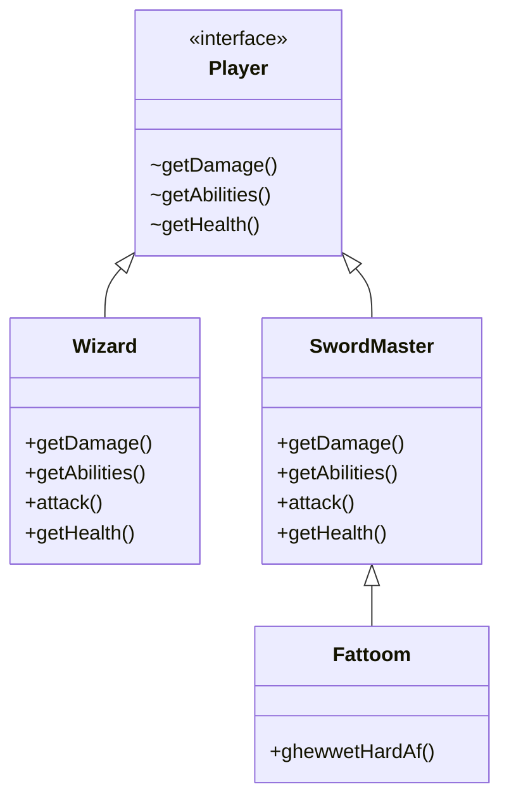

```mermaid
classDiagram
Player <|-- Wizard
Player <|-- SwordMaster
SwordMaster <|-- Fattoom
class Wizard {
+getDamage()
+getAbilities()
+attack()
+getHealth()
}
class Fattoom {
+ghewwetHardAf()
}
class SwordMaster {
+getDamage()
+getAbilities()
+attack()
+getHealth()
}
class Player {
<<interface>>
~getDamage()
~getAbilities()
~getHealth()
}
```